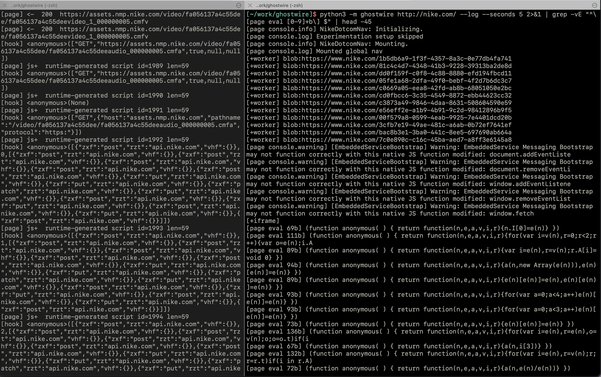
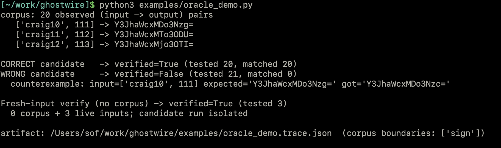

# ghostwire

Stealth runtime instrumentation for reverse-engineering very hostile client-side JavaScript anti-bot, captcha, fingerprinting, fraud and payment SDKs. It hooks functions, follows the whole target graph (page, workers, iframes), and observes resolved runtime values, without injecting anything into the page. It is built to be driven by an agent, and its one job is to tell that agent when the agent is wrong.


<!-- screenshot: a `python3 -m ghostwire <url>` run showing targets / scripts / captures -->

## The idea

An LLM reading obfuscated JavaScript is right about syntax almost always and right about behaviour about three times in five ([JsDeObsBench](https://github.com/Ch3nYe/JsDeObsBench): ~97% syntactic, ~61% semantic). So reading is a hypothesis is usually never a fact. ghostwire is the part that checks it.

You observe ground truth at a runtime boundary, a decoder, a signer, a crypto call. And form a candidate reimplementation. `gw_verify` runs that candidate, in an isolated page that cannot see the real function, against the captured ground-truth corpus **and** against the live target for fresh inputs, and hands back a structured diff with concrete counterexamples. Iterate until the diff is empty. Nothing inferred is trusted until then.

```python
import ghostwire
with ghostwire.attach("https://target/") as gw:
    gw.wait(1)
    gw.hook("window.sign", capture_returns=True, label="sign")   # observed (input -> output) pairs
    gw.wait(3)
    gw.verify("window.sign", "(u,p)=>btoa(u+':'+(p*7+1))",        # your reimplementation
              label="sign", fresh_inputs=[["zoe", 0], ["", 1]])
    # -> {"verified": false, "mismatches": [{"input": ["zoe",0], "expected": "...", "got": "..."}], ...}
```


<!-- screenshot: gw_verify output with verified=false and a counterexample -->

## Why CDP over a pipe, not in-page injection

Hooks are set with `Debugger.setBreakpointOnFunctionCall` on the live function object. The object is never replaced or wrapped, so the hook is invisible to the page's own defenses: `fn.toString()` native-code checks, Proxy traps, monkeypatch detection. That invisibility is the whole point — it is what lets you instrument code that is actively trying to detect you.

Chrome is driven over `--remote-debugging-pipe`, not a WebSocket. There is no open debugging port for the page to discover, and the core has no third-party dependencies — clone and run.
Other consequences/reasons of working at the protocol level:

- `evaluateOnCallFrame` reads the actual closure, not an isolated world like in playwright.
- Beats static deob. It reads resolved values, so it cracks runtime-rotated string arrays and bytecode VMs that static tools and source-reading models get wrong.
- Whole target graph. Flat-mode auto-attach follows workers and out-of-process iframes, where the crypto and anti-bot engines actually run.

## Run it

The core has no dependencies (yet); only the MCP server needs `mcp`.

```bash
python3 -m ghostwire https://target/ --seconds 5 --grep token --out trace.json
python3 -m ghostwire https://target/ --hook 'window.fn' --hook 'enc@@worker.js' --headful
```

## Cracking a rotated string array

`obfuscator.io` rotates its string array at load, so the array order in the source is a lie. A static reader, or a model like opus 6.8 copying the source array, reimplements the decoder against the wrong order and is silently wrong. ghostwire drives the page's own decoder over the full index range to get the real mapping, and the oracle catches the wrong reimplementation:

```
// example
ground truth (runtime, rotated):  0=craig 1=patched 2=osint 3=guest 4=admin ...
static view  (source order):      0=guest 1=admin   2=token 3=secret 4=login ...
static order matches runtime for 0/10 indices

naive static reimpl    -> verified=False (matched 0/10)
  counterexample: decode(0) is 'craig', naive gives 'guest'
runtime-derived reimpl -> verified=True  (matched 10/10)
```


<!-- screenshot: examples/obfuscated_strings.py output -->

```bash
python3 examples/obfuscated_strings.py   # the case above, end to end
python3 examples/selftest.py             # invisible hook + live args, with an invisibility proof
python3 examples/capture_demo.py         # eval / new Function / POST body, all captured
python3 examples/multitarget_demo.py     # worker auto-attach: source + network + in-worker hook
python3 examples/oracle_demo.py          # gw_verify catches a reimpl that drops a +1
python3 examples/heap_search.py          # find the live object holding a token, by value/constructor/key
python3 examples/origin_trace.py         # trace a token back to the exact function that builds it
python3 examples/dataflow_follow.py      # follow a signer's output to the function that consumes it
python3 examples/live_patch.py           # patch closure-held state found only via the heap, behaviour changes
python3 examples/heap_diff.py            # snapshot before/after an action -> the decoded secret it allocated
python3 examples/crypto_log.py           # recover the plaintext fed to crypto.subtle.* at the boundary
python3 examples/deob_strings.py         # dump a rotated string table by driving the real decoder
python3 examples/deob_vm.py              # trace a bytecode-VM dispatch loop into (pc, opcode, operand)
```

## From Claude Code

```bash
pip install mcp
claude mcp add ghostwire -- python3 -m ghostwire.mcp_server   # run from the repo checkout
```

Tools: `gw_attach`, `gw_targets`, `gw_hook`, `gw_captures`, `gw_corpus`, `gw_verify`, `gw_objects`, `gw_patch`, `gw_origin`, `gw_follow`, `gw_heapdiff`, `gw_crypto`, `gw_strings`, `gw_vm`, `gw_scripts`, `gw_network`, `gw_eval`, `gw_navigate`, `gw_save`, `gw_close`. The `skills/verify-reimplementation/` Agent Skill teaches the hypothesize -> capture -> verify loop. Every capture, corpus and trace is savable to a JSON artifact that reloads and re-verifies offline.


## Status

Done: pipe transport, whole-graph auto-attach, semi-invisible tracer, script + network probes, the verification oracle, heap snapshot + live-object search + patch, origin trace (where a value came from), followReturn dataflow (where a value goes next), heap-diff (what an action allocated), crypto-boundary logger, string-array + VM dumpers, CLI, MCP server

Next: anti-anti-debug hardening, and the Continental captcha end-to-end (re-derive the known answer key autonomously, gw_verify against the live target).

It is an arms race: CDP presence is itself detectable, so stealth is ongoing maintenance.
ghostwire is a security-research instrument — for analysis on systems you are authorized to test, the same category as Frida and mitmproxy blablabla ect
